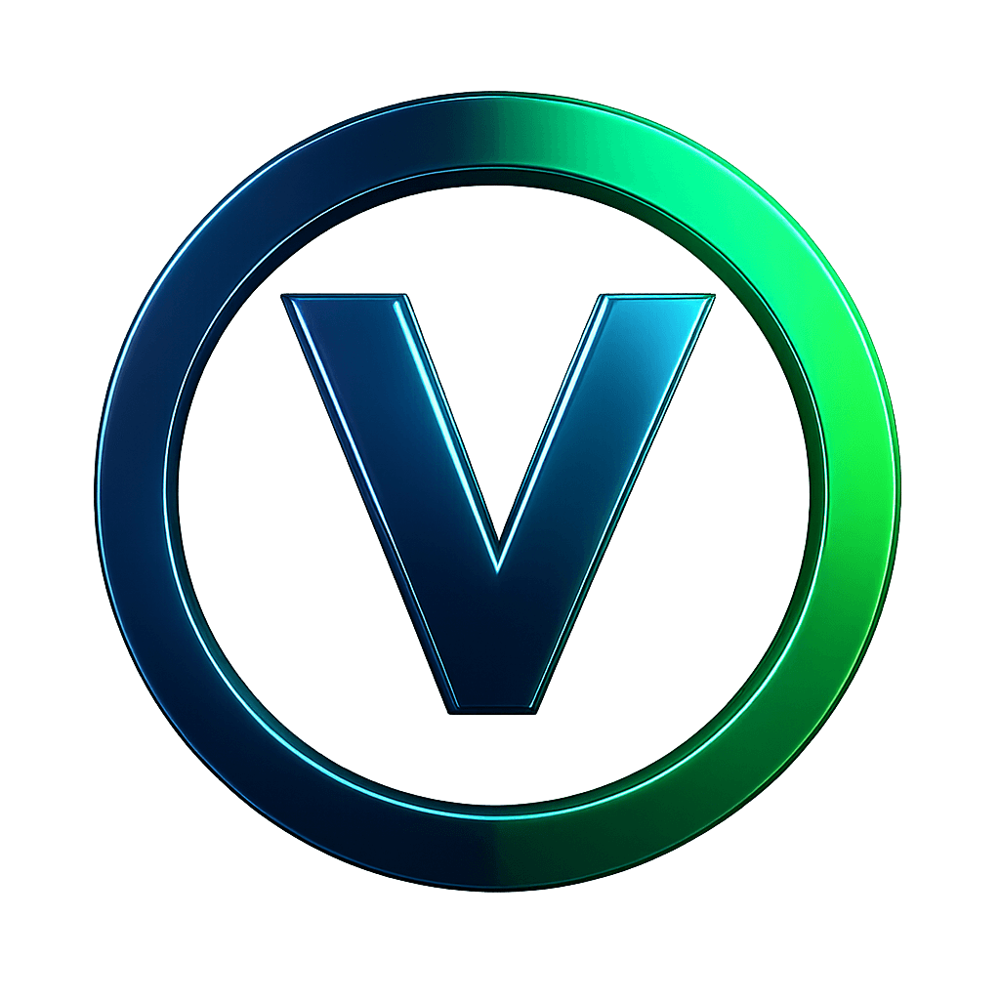

<p align="center">
  
</p>

# <a href="https://github.com/Micharl13/Vector-front-end-framework/tree/vDev?tab=readme-ov-file" size="500px">Go to vDev branch</a>

# Vector front-end framework
⚠️WIP—In Development Still⚠️ An open-source, lightweight CSS framework for building responsive websites. Some base code borrowed from [MDN Web Docs](https://developer.mozilla.org). Contributions welcome!

### Table of Contents
- [Features](#features)
- [Using Vector](#using-vector)
- [Contributing](#contributing)
- [License](#license)

## Features
- Minimal, modern CSS utilities
- Responsive grid and layout classes
- Buttons, typography, and color utilities
- Easy to use — just add the link in your HTML code

## Using Vector

You can get Vector in a couple of ways:

Link to the jsDelivr CDN:
```html
<link rel="stylesheet" href="https://cdn.jsdelivr.net/gh/Micharl13/Vector-front-end-framework@main/dist/vectorcss.css">
```
Download:

- [Download Source (ZIP)](https://github.com/Micharl13/Vector-front-end-framework/archive/refs/heads/main.zip)
- [Download Latest Release](https://github.com/Micharl13/Vector-front-end-framework/releases)

## Contributing

Contributions are welcome! Please read [CONTRIBUTING.md](CONTRIBUTING.md) for guidelines.

## License
Code released under the [MIT License](LICENSE).
